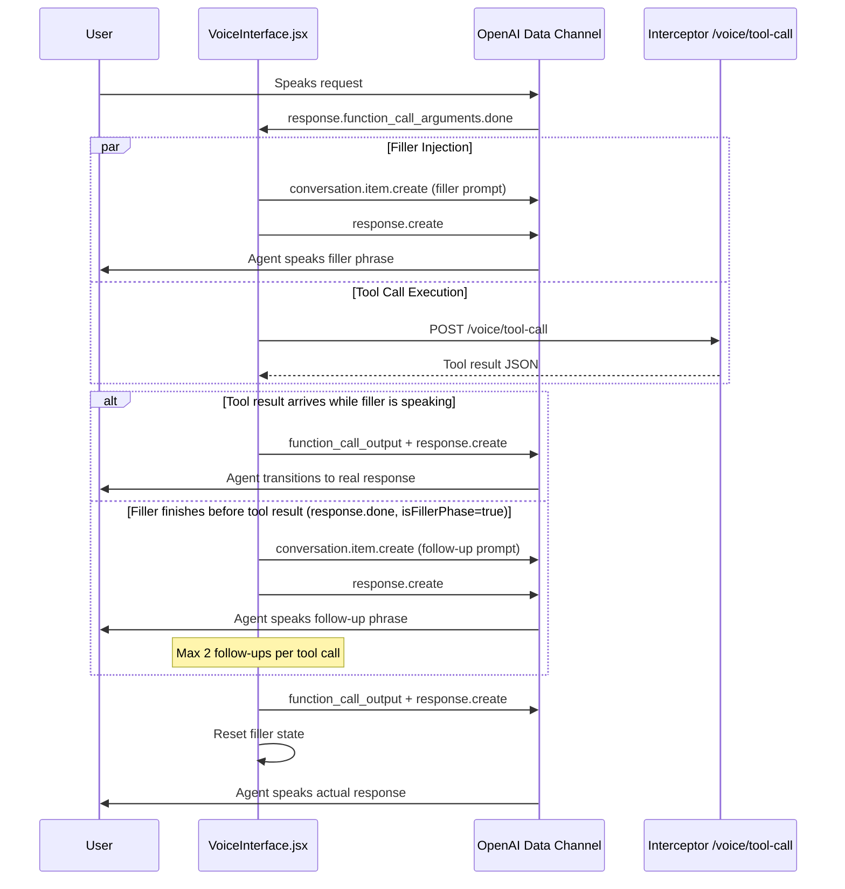

# Design Document: Voice Business Filler

## Overview

This feature replaces the synthesized hold music (`useHoldMusic`) with context-aware spoken filler phrases delivered by the OpenAI Realtime voice agent ("Jessica") during tool call processing. Instead of switching to a separate audio source, the frontend injects `[System: ...]` messages into the WebRTC data channel, prompting the model to speak natural filler phrases in its own voice while the tool call runs in parallel.

The implementation is entirely frontend-side within `VoiceInterface.jsx`. The Interceptor and Backend remain unchanged.

### Key Design Decisions

1. **Data channel injection over server-side orchestration**: Filler prompts are injected client-side via the existing `conversation.item.create` + `response.create` pattern (same as greeting and silence nudges). This avoids any Interceptor changes and keeps latency minimal.

2. **Client-side intent classification**: A pure function mirrors the server-side `intent_detector.py` keyword-matching approach but returns a simplified intent category string (not tool routing). This keeps filler prompts contextually relevant without adding network round trips.

3. **`isFillerPhase` flag for event disambiguation**: Since both filler responses and real tool-result responses emit `response.done`, a boolean ref distinguishes them so follow-up logic only fires during the filler phase.

4. **Maximum 2 follow-up prompts**: Caps chained filler to avoid the agent sounding robotic. After 2 follow-ups, the system stays silent until the tool result arrives.

## Architecture



## Components and Interfaces

### 1. Intent Classifier — `classifyIntent(transcript)`

A pure function added to `VoiceInterface.jsx` (or a co-located module).

```javascript
/**
 * Classifies a user transcript into an intent category via keyword matching.
 * @param {string} transcript - The user's last spoken message text.
 * @returns {string} One of: 'billing', 'roaming', 'outage', 'wallet',
 *                   'tickets', 'policy', 'validation', 'general'
 */
function classifyIntent(transcript) { ... }
```

Keyword mapping (mirrors `intent_detector.py` categories):

| Intent       | Keywords / Patterns                                                        |
|-------------|---------------------------------------------------------------------------|
| `billing`   | bill, invoice, charge, payment, pay, due, overdue, statement              |
| `roaming`   | roaming, roam, international, travel                                      |
| `outage`    | outage, down, network issue, service down, not working                    |
| `wallet`    | wallet, balance, credit, credits                                          |
| `tickets`   | ticket, tickets, support ticket, open ticket                              |
| `policy`    | policy, policies, rules, terms, conditions, eligib                        |
| `validation`| (not derived from transcript — set when tool name is `validate_user`)     |
| `general`   | fallback when no pattern matches                                          |

### 2. Filler Prompt Builder — `buildFillerPrompt(toolName, intent)`

A pure function that constructs the `[System: ...]` message text.

```javascript
/**
 * Builds a context-aware filler prompt for the voice agent.
 * @param {string} toolName - 'validate_user' or 'forward_to_backend'
 * @param {string} intent - The classified intent category.
 * @returns {string} The filler prompt text prefixed with [System: ...]
 */
function buildFillerPrompt(toolName, intent) { ... }
```

Rules:
- For `validate_user`: always returns a validation-themed prompt regardless of intent.
- For `forward_to_backend`: references the specific intent (e.g., "checking your billing", "looking into roaming").
- Instructs the model to speak 1–2 natural sentences and not repeat previous phrases.

### 3. Follow-Up Prompt Builder — `buildFollowUpPrompt()`

```javascript
/**
 * Builds a short follow-up filler prompt for continued silence filling.
 * @returns {string} The follow-up prompt text prefixed with [System: ...]
 */
function buildFollowUpPrompt() { ... }
```

Instructs the model to speak a short reassurance phrase (e.g., "Still looking...", "Almost there...") without repeating previous fillers.

### 4. Filler Orchestrator — modifications to `handleRealtimeEvent` and `response.function_call_arguments.done` handler

New refs in `VoiceInterface`:

```javascript
const intentRef = useRef('general')          // Current classified intent
const isFillerPhaseRef = useRef(false)        // True while filler is active, false after tool result sent
const toolCallPendingRef = useRef(false)      // True while tool call HTTP request is in flight
const followUpCountRef = useRef(0)            // Number of follow-up prompts sent for current tool call
const MAX_FOLLOW_UPS = 2
```

### 5. Data Channel Message Format

Filler prompts use the same format as the existing greeting and silence nudge:

```json
{
  "type": "conversation.item.create",
  "item": {
    "type": "message",
    "role": "user",
    "content": [{
      "type": "input_text",
      "text": "[System: <filler instruction>]"
    }]
  }
}
```

Followed immediately by:

```json
{ "type": "response.create" }
```

## Data Models

### Intent Categories

```typescript
type IntentCategory =
  | 'billing'
  | 'roaming'
  | 'outage'
  | 'wallet'
  | 'tickets'
  | 'policy'
  | 'validation'
  | 'general'
```

### Filler Orchestrator State (refs)

| Ref                  | Type      | Initial   | Description                                              |
|----------------------|-----------|-----------|----------------------------------------------------------|
| `intentRef`          | `string`  | `'general'` | Last classified intent from user transcript             |
| `isFillerPhaseRef`   | `boolean` | `false`   | Whether current response.done events are from filler     |
| `toolCallPendingRef` | `boolean` | `false`   | Whether the tool call HTTP request is still in flight    |
| `followUpCountRef`   | `number`  | `0`       | Follow-up prompts sent for the current tool call         |

### Filler Prompt Templates

| Tool Name            | Intent        | Prompt Theme                                          |
|----------------------|---------------|-------------------------------------------------------|
| `validate_user`      | (any)         | Account verification / looking up the ID              |
| `forward_to_backend` | `billing`     | Checking billing / pulling up invoices                |
| `forward_to_backend` | `roaming`     | Looking into roaming status                           |
| `forward_to_backend` | `outage`      | Checking for outages in the area                      |
| `forward_to_backend` | `wallet`      | Checking wallet / credit balance                      |
| `forward_to_backend` | `tickets`     | Looking at support tickets                            |
| `forward_to_backend` | `policy`      | Looking up policy information                         |
| `forward_to_backend` | `general`     | Generic "looking into that" phrase                     |


## Correctness Properties

*A property is a characteristic or behavior that should hold true across all valid executions of a system — essentially, a formal statement about what the system should do. Properties serve as the bridge between human-readable specifications and machine-verifiable correctness guarantees.*

### Property 1: Intent classifier always returns a valid category and defaults to general

*For any* transcript string, `classifyIntent(transcript)` SHALL return one of the 8 defined intent categories (`billing`, `roaming`, `outage`, `wallet`, `tickets`, `policy`, `validation`, `general`). Furthermore, *for any* transcript string that contains none of the defined keyword patterns, the result SHALL be `general`. The function SHALL be deterministic: *for any* transcript, calling `classifyIntent` multiple times with the same input SHALL always return the same result.

**Validates: Requirements 3.1, 3.3, 3.5**

### Property 2: Filler prompt format and context-awareness

*For any* valid `(toolName, intent)` pair where `toolName` is one of `validate_user` or `forward_to_backend` and `intent` is a valid intent category, `buildFillerPrompt(toolName, intent)` SHALL return a non-empty string prefixed with `[System:` and ending with `]`. *For any* intent category, when `toolName` is `validate_user`, the prompt content SHALL be validation-themed (account verification). *For any* intent category, when `toolName` is `forward_to_backend`, the prompt content SHALL reference language specific to that intent category.

**Validates: Requirements 1.2, 4.1, 4.2, 4.3, 4.5**

### Property 3: Follow-up count cap and post-result silence

*For any* tool call lifecycle with any number N of `response.done` events received during the filler phase, the number of follow-up prompts sent SHALL be at most `min(N, 2)`. *For any* `response.done` event received after the tool call result has been delivered (`isFillerPhase` is `false`), no follow-up prompt SHALL be sent.

**Validates: Requirements 2.4, 5.3**

## Error Handling

### Tool Call Failures

- If the `fetch` to `/voice/tool-call` fails or returns a non-200 status, the existing error handling in `handleToolCall` returns a JSON error string. The filler orchestrator still sends the `function_call_output` with the error result, allowing the voice agent to communicate the failure naturally. All filler state is reset regardless of success or failure.

### Invalid Tool Arguments

- If OpenAI sends malformed JSON in `response.function_call_arguments.done`, the existing `try/catch` around `JSON.parse` returns an error result. The filler prompt is still injected (the user still hears a natural phrase), and the error result flows through normally.

### Data Channel Closure During Filler

- All data channel sends are guarded by `dc && dc.readyState === 'open'` checks. If the channel closes mid-filler, sends are silently skipped and the tool call result is discarded. The `disconnect` handler resets all filler state.

### Rapid Sequential Tool Calls

- The existing `isProcessingToolRef` guard prevents duplicate tool call processing. If a second `response.function_call_arguments.done` arrives while a tool call is in flight, it is skipped. Filler state from the first call is reset when it completes.

### Follow-Up Prompt After Disconnect

- The `disconnect` function resets `isFillerPhaseRef`, `toolCallPendingRef`, and `followUpCountRef`, preventing stale follow-up prompts from firing after the session ends.

## Testing Strategy

### Property-Based Tests (fast-check)

Property-based tests use [fast-check](https://github.com/dubzzz/fast-check) to validate the correctness properties above. Each test runs a minimum of 100 iterations.

| Property | Test Description | Tag |
|----------|-----------------|-----|
| Property 1 | Generate arbitrary strings, verify `classifyIntent` returns a valid category. Generate strings with no intent keywords, verify result is `general`. Call twice with same input, verify same result. | `Feature: voice-business-filler, Property 1: Intent classifier always returns a valid category and defaults to general` |
| Property 2 | Generate all combinations of `(toolName, intent)`, verify `buildFillerPrompt` output starts with `[System:`, ends with `]`, is non-empty, and contains intent-appropriate content. | `Feature: voice-business-filler, Property 2: Filler prompt format and context-awareness` |
| Property 3 | Generate random sequences of `response.done` events (varying N from 0 to 10), simulate the filler orchestrator logic, verify follow-up count ≤ 2. Then simulate tool result delivery and verify no further follow-ups. | `Feature: voice-business-filler, Property 3: Follow-up count cap and post-result silence` |

### Unit Tests (example-based)

| Test | Validates |
|------|-----------|
| `classifyIntent("what's my bill")` returns `billing` | Req 3.1, 3.2 |
| `classifyIntent("is there an outage")` returns `outage` | Req 3.1, 3.2 |
| `classifyIntent("hello there")` returns `general` | Req 3.3 |
| `buildFillerPrompt('validate_user', 'billing')` contains verification language | Req 4.2 |
| `buildFillerPrompt('forward_to_backend', 'billing')` contains billing language | Req 4.3 |
| `buildFollowUpPrompt()` returns `[System: ...]` formatted string | Req 2.3 |
| Filler prompt is injected on `response.function_call_arguments.done` | Req 1.1, 1.3 |
| Tool call and filler injection run in parallel | Req 1.4 |
| `function_call_output` is sent when tool result arrives | Req 1.5 |
| `isFillerPhaseRef` is set to `false` after tool result sent | Req 5.2 |
| All filler state resets on tool call completion | Req 5.5 |
| All filler state resets on disconnect | Req 6.3 |
| `useHoldMusic` is not imported in `VoiceInterface.jsx` | Req 6.1 |

### Integration / Smoke Tests

| Test | Validates |
|------|-----------|
| `useHoldMusic.js` file exists but is not imported anywhere | Req 6.4 |
| No Web Audio API calls during tool call processing | Req 6.2 |
| Follow-up prompt fires when `response.done` arrives during filler phase with tool still pending | Req 2.2 |
| Follow-up count resets when tool call completes | Req 2.5 |
| `intentRef` updates on each new transcript event | Req 3.4 |
