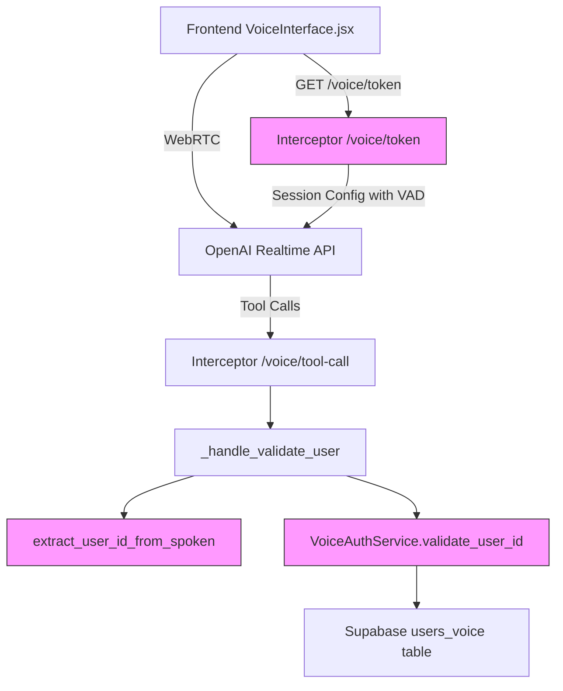

# Design Document: Voice UX Fixes

## Overview

This design addresses two distinct UX issues in the voice telecom support application:

1. **VAD Tuning** — Adjusting the OpenAI Realtime API server-side VAD parameters in `Interceptor/main.py` to make the assistant easier to interrupt without becoming overly sensitive to background noise.
2. **User ID Validation Hardening** — Adding format and length validation to the user ID extraction and validation pipeline so that obviously invalid IDs (too short, too long) are rejected early with clear feedback.

Both changes are localized to the Interceptor service and require no frontend or backend modifications.

## Architecture

The changes affect the Interceptor service only:



Pink nodes indicate the components being modified.

### VAD Flow
The `/voice/token` endpoint creates an OpenAI Realtime session with VAD parameters in the `turn_detection` config. The only change is updating the three numeric values.

### Validation Flow
```
Raw spoken input → extract_user_id_from_spoken() → length check → validate_user_id() → length check → DB query → response
```

The validation pipeline gains two new gates: a length check after extraction and a length check before the DB query.

## Components and Interfaces

### Modified Components

#### 1. `Interceptor/main.py` — `/voice/token` endpoint
- **Change**: Update `turn_detection` dict values
- **Interface**: No API change. The endpoint still returns `{ ephemeral_token, model, voice, expires_at }`.

#### 2. `Interceptor/utils/helpers.py` — `extract_user_id_from_spoken()`
- **Change**: Add length validation after stripping non-digit characters. Return empty string if result is < 2 or > 10 digits. Add logging.
- **Interface**: Same signature `(raw_user_id: str) -> str`. Empty string now also signals "invalid length" in addition to "no input".

#### 3. `Interceptor/services/voice_auth.py` — `validate_user_id()`
- **Change**: Add explicit length check before DB query. Add logging for received ID and outcome.
- **Interface**: Same signature `(spoken_user_id: str) -> tuple[bool, Optional[str], str]`. No change to return type.

#### 4. `Interceptor/main.py` — `_handle_validate_user()`
- **Change**: Ensure the JSON response for failed validation includes both `reason` and `message` fields consistently.
- **Interface**: Same return shape `{ call_id, result: json_string }`.

### Constants

| Constant | Old Value | New Value | Location |
|---|---|---|---|
| VAD threshold | 0.75 | 0.55 | `main.py` turn_detection |
| Silence duration | 700ms | 400ms | `main.py` turn_detection |
| Prefix padding | 250ms | 200ms | `main.py` turn_detection |
| Min user ID length | (none) | 2 | `helpers.py`, `voice_auth.py` |
| Max user ID length | (none) | 10 | `helpers.py`, `voice_auth.py` |

## Data Models

No data model changes. The `users_voice` Supabase table schema is unchanged. All changes are to in-flight validation logic and configuration constants.

### Validation Constants

```python
USER_ID_MIN_LENGTH = 2
USER_ID_MAX_LENGTH = 10
```

These constants should be defined in `Interceptor/utils/helpers.py` and imported by `voice_auth.py` to keep the length constraints in a single source of truth.


## Correctness Properties

*A property is a characteristic or behavior that should hold true across all valid executions of a system — essentially, a formal statement about what the system should do. Properties serve as the bridge between human-readable specifications and machine-verifiable correctness guarantees.*

### Property 1: Extraction produces digits only

*For any* input string, the output of `extract_user_id_from_spoken()` contains only digit characters (0-9) or is the empty string.

**Validates: Requirements 2.1**

### Property 2: Extraction enforces length bounds

*For any* input string whose digit-only content has fewer than 2 digits or more than 10 digits, `extract_user_id_from_spoken()` returns the empty string.

**Validates: Requirements 2.2**

### Property 3: Validation rejects invalid-length IDs with proper response

*For any* user ID string whose length is fewer than 2 or more than 10 digits, `validate_user_id()` returns a tuple `(False, None, message)` where `message` is a non-empty string describing the rejection reason.

**Validates: Requirements 2.3, 2.4**

### Property 4: Validation returns proper success tuple

*For any* numeric user ID string within the valid length range that exists in the database, `validate_user_id()` returns a tuple `(True, customer_id, message)` where `customer_id` is a non-empty string and `message` is a non-empty string.

**Validates: Requirements 2.5**

### Property 5: Handler returns proper failure JSON structure

*For any* failed validation result from `validate_user_id()`, the `_handle_validate_user` handler returns a JSON object containing `authenticated` set to `false`, a non-empty `reason` field, and a non-empty `message` field.

**Validates: Requirements 3.2**

### Property 6: Handler returns proper success JSON structure

*For any* successful validation result from `validate_user_id()`, the `_handle_validate_user` handler returns a JSON object containing `authenticated` set to `true`, a non-empty `customer_id` field, and a non-empty `message` field.

**Validates: Requirements 3.3**

### Property 7: Extraction logs raw input, output, and rejection reason

*For any* input to `extract_user_id_from_spoken()`, the function emits an INFO-level log containing the raw input and normalized output. If the input is rejected due to length, the log also contains the rejection reason.

**Validates: Requirements 4.1, 4.2**

### Property 8: Validation logs ID, length, and outcome

*For any* call to `validate_user_id()`, the function emits INFO-level logs containing the received user ID, its length, and the validation outcome (success or failure reason).

**Validates: Requirements 4.3, 4.4**

## Error Handling

### VAD Configuration
- If the OpenAI session creation fails, the existing error handling in `/voice/token` already returns a 502 with the error body. No changes needed.

### User ID Extraction
- Empty input after stripping → returns empty string (existing behavior, unchanged).
- Input with only non-digit characters → returns empty string (existing behavior, unchanged).
- Input with valid digits but wrong length → returns empty string (new behavior).

### User ID Validation
- Supabase not initialized → returns `(False, None, "System error: Validation service unavailable")` (existing).
- Non-numeric ID → returns `(False, None, "Invalid User ID format...")` (existing).
- ID outside length bounds → returns `(False, None, "User ID must be between 2 and 10 digits...")` (new).
- DB query failure → returns `(False, None, "I'm having trouble verifying...")` (existing).
- ID not found in DB → returns `(False, None, "I heard X, but I couldn't find that ID...")` (existing).

### Tool Call Handler
- Empty user ID after extraction → returns `{ authenticated: false, reason: "..." }` (existing, ensure `message` field added).
- Failed validation → returns `{ authenticated: false, reason: "...", message: "..." }` (ensure both fields present).

## Testing Strategy

### Unit Tests
- Verify VAD config values are within specified ranges (Requirements 1.1–1.4).
- Verify `extract_user_id_from_spoken()` with specific edge cases: empty string, whitespace only, single digit, 11+ digits, mixed alphanumeric.
- Verify `validate_user_id()` with mocked Supabase for: valid ID found, valid ID not found, invalid length, non-numeric, Supabase unavailable.
- Verify `_handle_validate_user` response structure for success and failure paths.

### Property-Based Tests
- Use `hypothesis` library for Python property-based testing.
- Minimum 100 iterations per property test.
- Each test tagged with: **Feature: voice-ux-fixes, Property {N}: {title}**

| Property | Test Strategy |
|---|---|
| Property 1: Digits only | Generate random strings via `hypothesis.strategies.text()`, verify output is digits-only or empty |
| Property 2: Length bounds | Generate strings with known digit counts outside [2, 10], verify empty return |
| Property 3: Validation rejects invalid length | Generate digit strings of length < 2 or > 10, mock Supabase, verify (False, None, message) |
| Property 4: Validation success tuple | Generate digit strings in [2, 10] range, mock Supabase to return match, verify (True, id, message) |
| Property 5: Handler failure JSON | Mock validate_user_id to return failure, verify JSON structure |
| Property 6: Handler success JSON | Mock validate_user_id to return success, verify JSON structure |
| Property 7: Extraction logging | Capture log output for random inputs, verify raw/normalized/rejection logged |
| Property 8: Validation logging | Capture log output for random IDs, verify ID/length/outcome logged |
